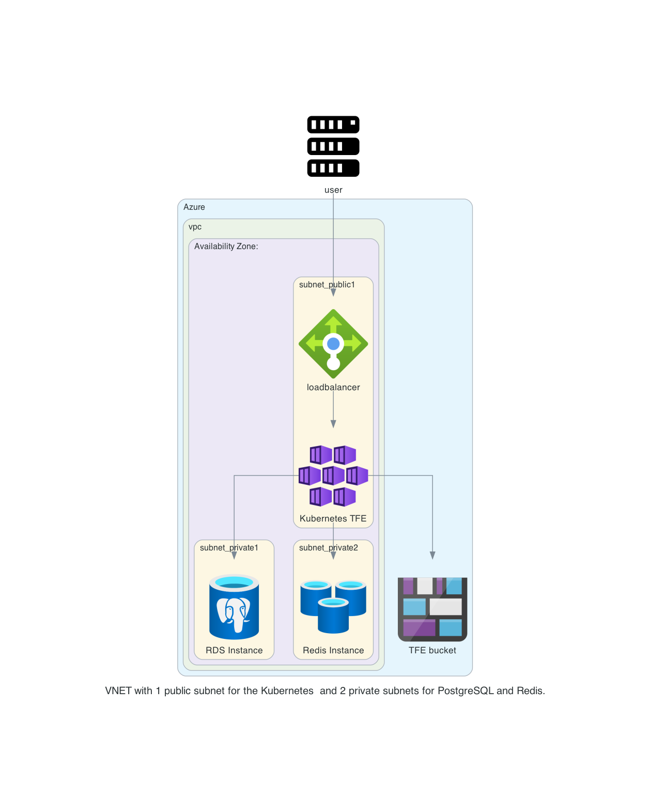

# Manual steps

These are the manual steps using the Azure Portal to create the Kubernetes environment where the TFE container can be deployed

## diagram
Here is a diagram of what we create

  

# Create the Azure infrastructure

- Create a resource group where all the resources will fall under  
   
   

- Create a network   
  
  
   
   


- create an network security group     
   
   
  - Go to the inbound security rules and add the following ports 
    - 22 ssh
    - 80 http
    - 443 https
    - 5432 postgresql
    - 6379 redis non-ssl
    - 6380 redis ssl    
The overview should look like the following   
   

- create a NAT gateway   
   
   
   

- create subnets  
public subnet  
  
private1 subnet  
  
  
private2 subnet  
  
overview  
   


- PostgreSQL Flex   
  
  
  
   
add a database called tfe  
  


- After the database is create you need to change the following because of this article https://support.hashicorp.com/hc/en-us/articles/4548903433235-Terraform-Enterprise-External-Services-mode-with-Azure-Database-for-PostgreSQL-Flexible-Server-Failed-to-Initialize-**Plugins**
Select CITEXT, HSTORE, and UUID-OSSP  
  
Result should be    
  

- Redis Cache  
  
  
  
   

- Storage account   
  
  
  
  
  
  


- create a container   
   

save the keys and all   
   

- Create the Azure Kubernetes Service   
  
   
  
  
  
  

# deploying the TFE helm chart 

- Make sure you can connect to the Kubernetes cluster
```
az aks get-credentials --resource-group tfe11-manual --name tfe11
```
- check that you see the pods from all namespace. This should give some results
```
kubectl get pods -A
```
- create the namespace
```
kubectl create namespace terraform-enterprise
```
- create the docker secret
```
kubectl create secret docker-registry terraform-enterprise --docker-server=images.releases.hashicorp.com --docker-username=terraform --docker-password="license_content_from_hashicorp" -n terraform-enterprise
```
- Have the yaml file with the correct values
```
replicaCount: 1
tls:
  certData: "xxxxxxx=="
  keyData: "xxxxxxxx=="
  caCertData: "xxxxxxx=="
image:
  repository: images.releases.hashicorp.com
  name: hashicorp/terraform-enterprise
  tag: v202312-1
env:
  variables:
    TFE_HOSTNAME: tfe11.aws.munnep.com
    TFE_IACT_SUBNETS: "0.0.0.0/0"

    # Database Settings
    TFE_DATABASE_USER: tfe
    TFE_DATABASE_PASSWORD: "xxxxxxx"
    TFE_DATABASE_HOST: tfe11.postgres.database.azure.com
    TFE_DATABASE_NAME: tfe
    TFE_DATABASE_PARAMETERS: "sslmode=require"
    
    # Redis settings
    TFE_REDIS_HOST: tfe11.redis.cache.windows.net:6379
    TFE_REDIS_PASSWORD: xxxxx
    TFE_REDIS_USE_AUTH: true
    
    # Object storage settings.
    TFE_OBJECT_STORAGE_TYPE: "azure"
    TFE_OBJECT_STORAGE_AZURE_ACCOUNT_NAME: patricktfe11manual
    TFE_OBJECT_STORAGE_AZURE_CONTAINER: tfe11
    TFE_OBJECT_STORAGE_AZURE_ACCOUNT_KEY: 
  secrets:
    TFE_DATABASE_PASSWORD: "xxxxxxx"
    TFE_ENCRYPTION_PASSWORD:  "xxxxxx"
    TFE_LICENSE: "your_license"
```
- install the helm chart 
```
helm install terraform-enterprise hashicorp/terraform-enterprise -n terraform-enterprise --values overrides.yaml
```
- After a few minutes the pod should be up and running
```
kubectl get pods -n terraform-enterprise --watch
NAME                                    READY   STATUS              RESTARTS   AGE
terraform-enterprise-64d7bc4b6b-2l9rt   0/1     ContainerCreating   0          16s
terraform-enterprise-64d7bc4b6b-2l9rt   0/1     Running             0          26s
terraform-enterprise-64d7bc4b6b-2l9rt   1/1     Running             0          2m51s
```
- This should also have created a loadbalancer. If not uninstall the helm chart and install it again. 
```
kubectl get services -n terraform-enterprise                              
NAME                   TYPE           CLUSTER-IP    EXTERNAL-IP     PORT(S)         AGE
terraform-enterprise   LoadBalancer   10.0.18.149   52.146.55.195   443:32625/TCP   67s
```
- Create an A records in you DNS to connect to the TFE environment   
   
- Connect to the environment on your url and see the login screen   
   
- Get the token to create the first admin user
```
kubectl exec -it terraform-enterprise-64d7bc4b6b-xdzgd -n terraform-enterprise -- tfectl admin token
391ad31a26c7cccc2484ec3aea071782231486bdb79894d97bc32bff5af949ba
```
- Go to a browser with the token from above   
https://tfe11.aws.munnep.com/admin/account/new?token=391ad31a26c7cccc2484ec3aea071782231486bdb79894d97bc32bff5af949ba
- Fill in the following information  
  
- Now you can login and create a new organization

- Create a workspace and do a run to verify all is working correctly  
